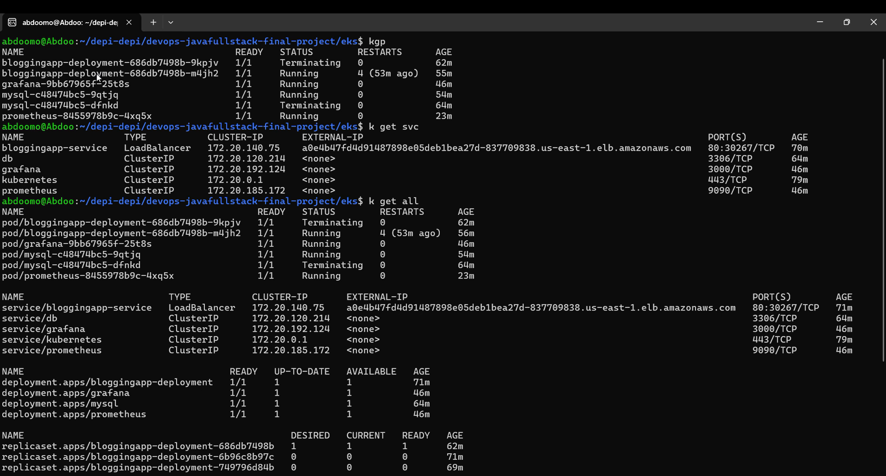
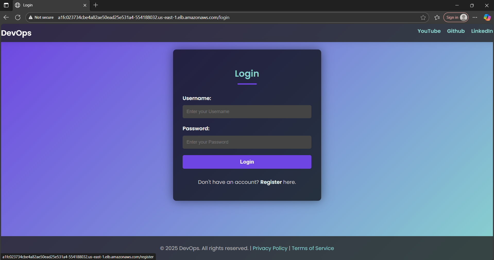
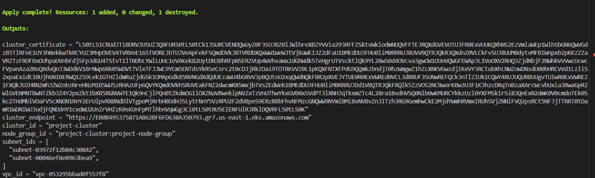
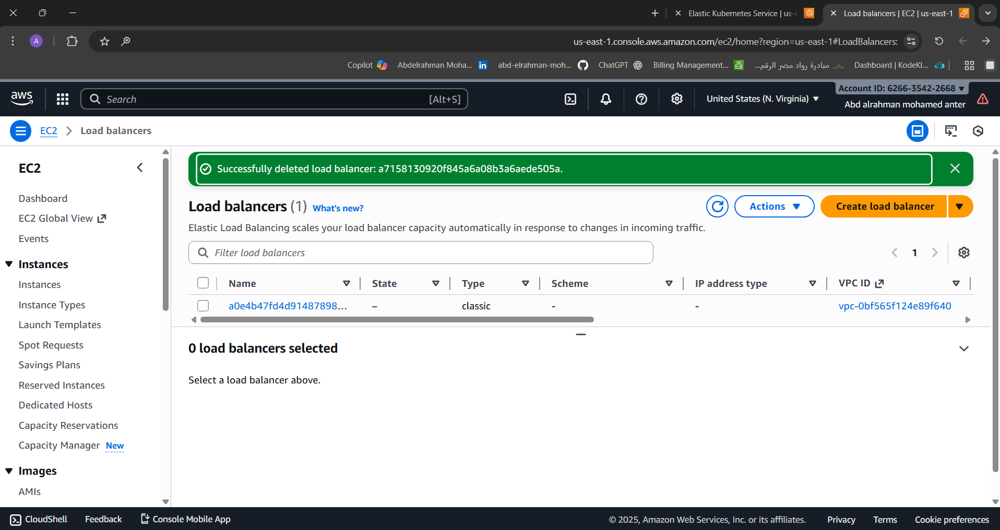
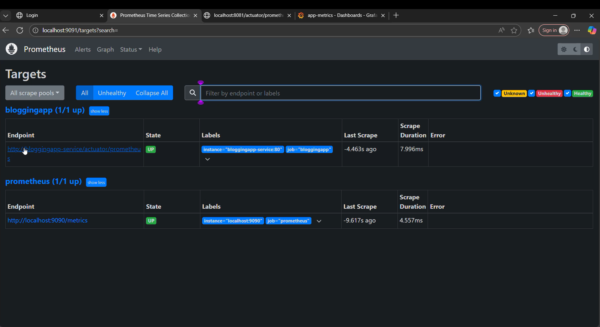
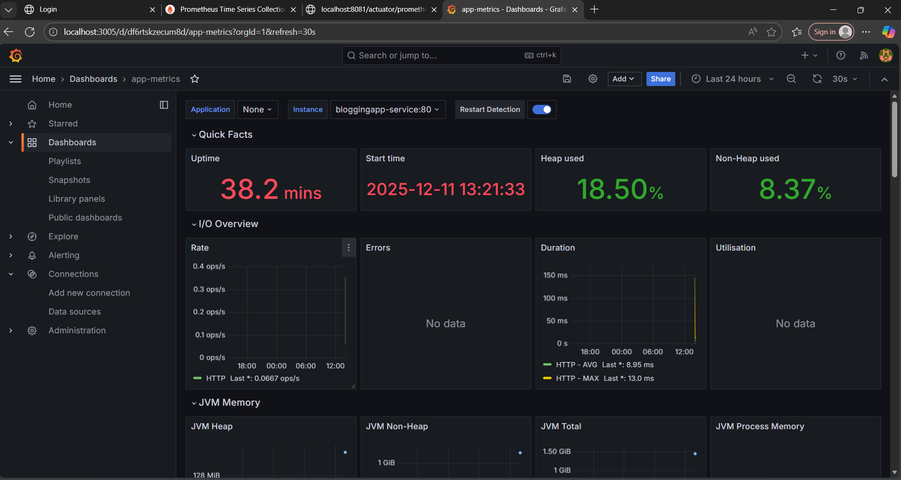
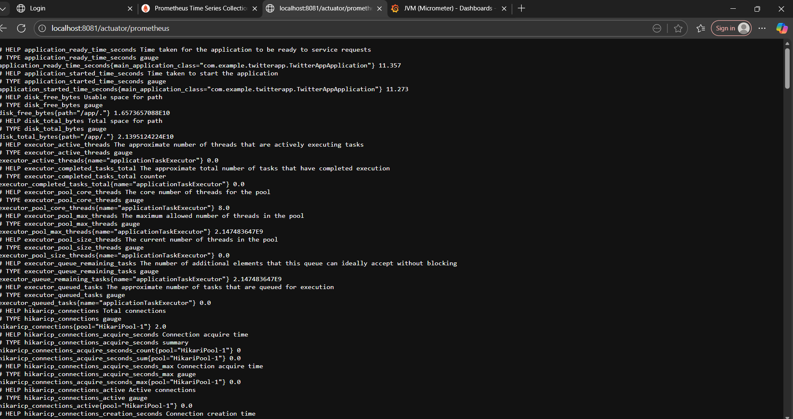
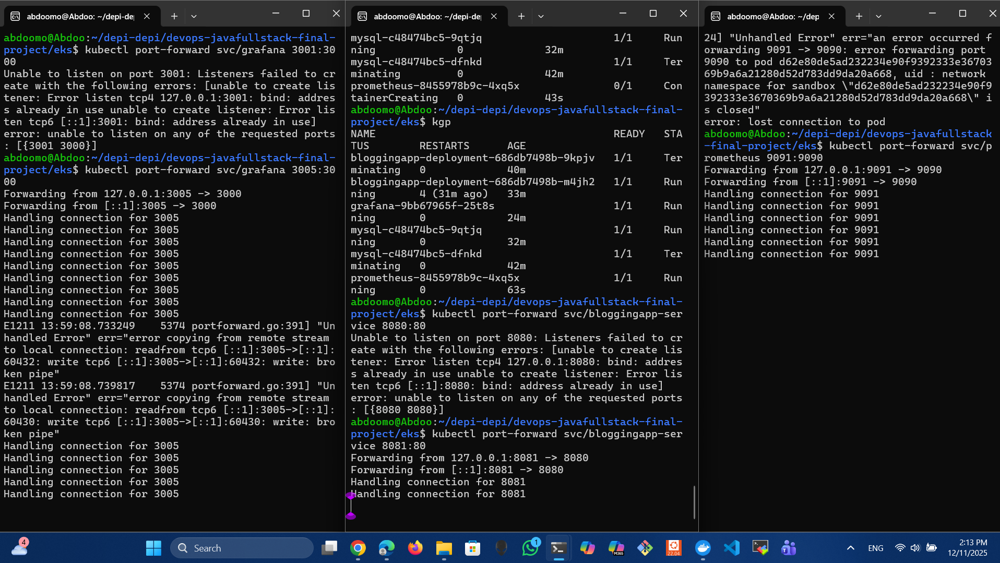

# 🚀 AWS EKS Deployment with Terraform, Kubernetes, Argo CD (GitOps), Prometheus, Grafana & MySQL

This project demonstrates a complete **production-like DevOps pipeline** deployed on **Amazon EKS**, fully automated with **Terraform**, monitored with **Prometheus & Grafana**, and continuously deployed using **Argo CD (GitOps)**.
---

# Workflow 

                    ┌────────────┐
           │ Terraform  │
           │  Init/Apply│
           └─────┬──────┘
                 │
                 ▼
           ┌────────────┐
           │ AWS EKS    │
           │ Cluster +  │
           │ Node Group │
           └─────┬──────┘
                 │
                 ▼
           ┌──────────────┐
           │ Kubernetes   │
           │ Workloads    │
           │ (Pods/DB/    │
           │ Services)    │
           └─────┬────────┘
       ┌─────────┴─────────┐
       ▼                   ▼
┌──────────────┐     ┌──────────────┐
│  Argo CD     │     │ Prometheus   │
│ GitOps       │     │ Monitoring   │
│ Continuous   │     └─────┬────────┘
│ Deployment   │           │
└──────────────┘           ▼
                        ┌──────────────┐
                        │ Grafana      │
                        │ Dashboards   │
                        └──────────────┘

---

# 📸 Screenshots

* **EKS Resources Diagram:**
  

* **Application Running :**
  

* **Argo CD Dashboard:**
  

* **Terraform Apply Output:**
  

* **Load Balancer / Service:**
  

* **Prometheus UI:**
  

* ** Grafana Dashboards:**
  

* **Metrics / Monitoring:**
  

* **Port Forward Example for Prometheus & Grafana :**
  

---

# 🏗️ Architecture Summary

### 🔹 Terraform creates:

* VPC (10.0.0.0/16)
* **2 Public Subnets** across **AZ[0] & AZ[1]**
* Internet Gateway
* Route Tables
* Security Groups
* IAM Roles for EKS & NodeGroup
* **EKS Cluster** (`project-cluster`)
* **Node Group** (4 nodes – t3.micro)

---

# 📁 Project Structure

```
eks/
├── argocd-mainfast.yaml
├── deployment.yaml
├── svc.yaml
├── db.yaml
├── prometheus-configmap.yaml
├── prometheus-deployment.yaml
├── grafana-deployment.yaml
├── main.tf
├── variables.tf
├── output.tf
├── terraform.tfstate
└── terraform.tfstate.backup
screens/
├── all-resources.png
├── app.png
├── argo.jpg
├── cluster.png
├── grafana.png
├── llb.png
├── metrics.png
├── portforward.png
├── prometheus.png
└── tf-out.png
```

---

# 🧩 Terraform (main.tf)

This Terraform file builds the **entire AWS infrastructure**:

### ✔️ VPC + Subnets

* VPC: `10.0.0.0/16`
* **Two subnets**, auto-assigned:

  * `project-subnet-0` → AZ[0]
  * `project-subnet-1` → AZ[1]
* Public because `map_public_ip_on_launch = true`

### ✔️ Internet Gateway + Route Table

Routes `0.0.0.0/0` to IGW.

### ✔️ Security Groups

* Cluster SG (egress only)
* Node SG (SSH allowed for your IP: `156.221.20.201/32`)
* Full communication between cluster & nodes

### ✔️ IAM Roles

* Cluster Role
* NodeGroup Role
* All required AWS EKS policies

### ✔️ EKS Cluster

```
name = "project-cluster"
```

### ✔️ NodeGroup

* 4 nodes
* `t3.micro`
* SSH enabled
* AutoScaling (min=2, max=5)

---

# 📦 Kubernetes Manifests

### 👉 MySQL (`db.yaml`)

* MySQL 8
* Database: `twitterdb`
* Password: `your--pass`
* Service: `db` on port 3306

---

### 👉 Prometheus (`prometheus-deployment.yaml` + ConfigMap)

* Prometheus 2.52
* Service: ClusterIP
* Reads config from ConfigMap

---

### 👉 Grafana (`grafana-deployment.yaml`)

* Grafana 11
* Service: ClusterIP
* Port 3000

---

### 👉 Application Deployment (`deployment.yaml`)

Your Java full-stack application:

* Pods
* Labels
* Service (NodePort/LoadBalancer)

---

### 👉 GitOps with Argo CD (`argocd-mainfast.yaml`)

* ArgoCD monitors your Git repo
* Any push → auto deploy to EKS
* Full GitOps CI/CD pipeline

---

# 🚀 Deploying

## 1️⃣ Initialize Terraform

```bash
terraform init
```

## 2️⃣ Apply

```bash
terraform apply -auto-approve
```

---

# 🔐 Connect to EKS

```bash
aws eks update-kubeconfig \
  --region us-east-1 \
  --name project-cluster
```

---

# 📥 Deploy Kubernetes Workloads

```bash
kubectl apply -f db.yaml
kubectl apply -f prometheus-configmap.yaml
kubectl apply -f prometheus-deployment.yaml
kubectl apply -f grafana-deployment.yaml
kubectl apply -f deployment.yaml
kubectl apply -f svc.yaml
```

---

# 🤖 Enable GitOps with Argo CD

```bash
kubectl apply -f argocd-mainfast.yaml
```

Get ArgoCD password:

```bash
kubectl -n argocd get secret argocd-initial-admin-secret \
  -o jsonpath="{.data.password}" | base64 --decode
```

---

# 📊 Monitoring

### Prometheus

```bash
kubectl port-forward svc/prometheus 9090:9090
```

### Grafana

```bash
kubectl port-forward svc/grafana 3000:3000
```

Default login:

```
admin / admin
```

---

# 🛡️ Security Notes

* SSH only allowed from your IP: `<your IP>/32`
* Monitoring stack isolated via ClusterIP
* DB internal-only (no public exposure)

---
