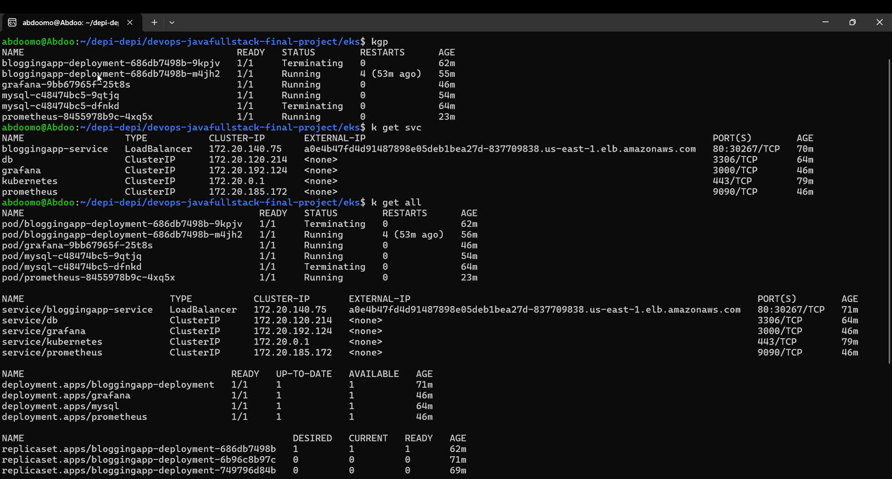
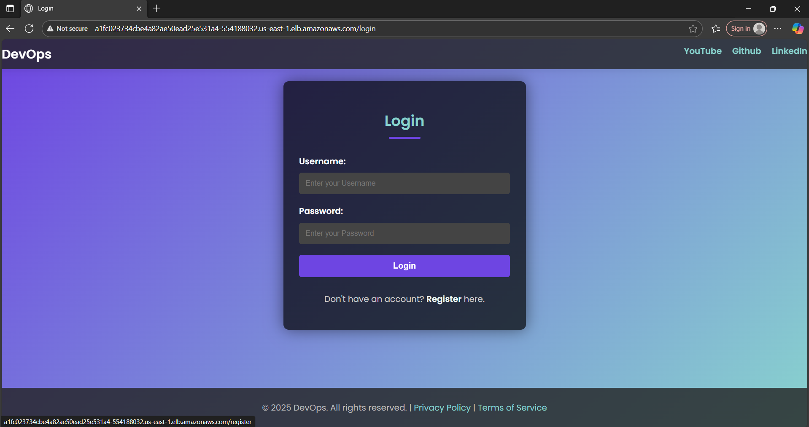
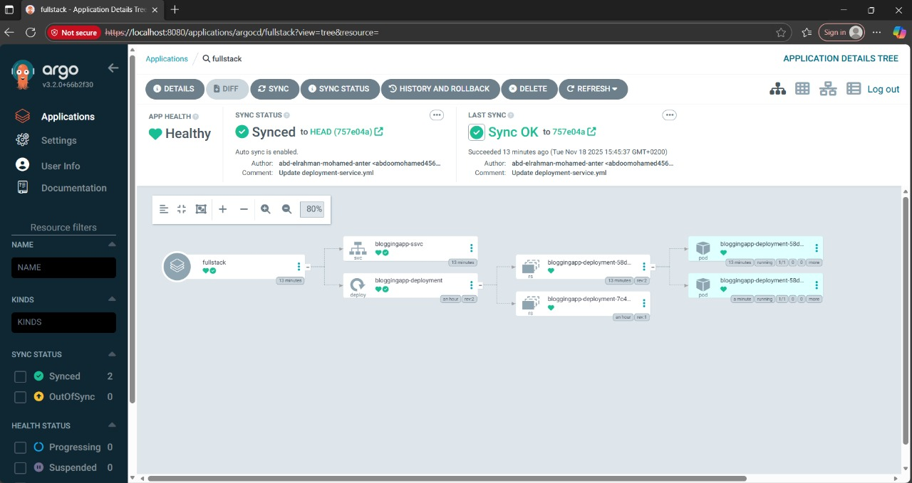
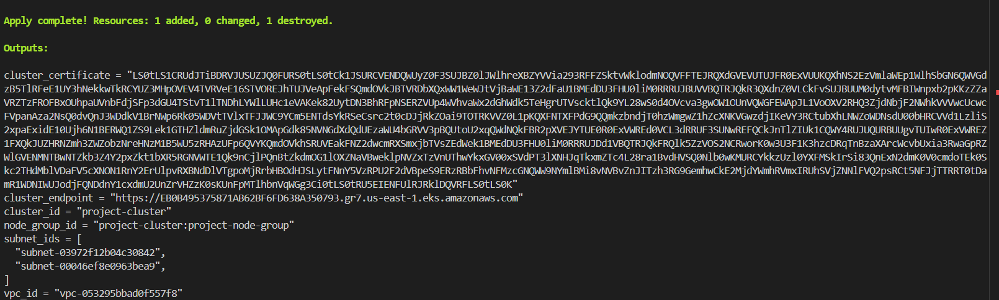
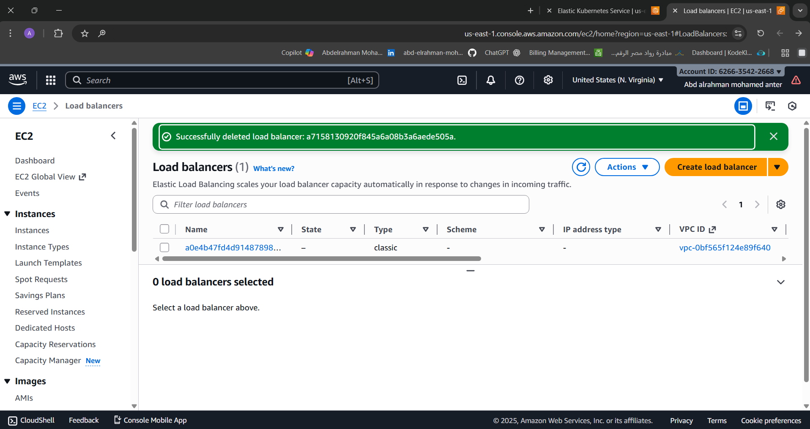
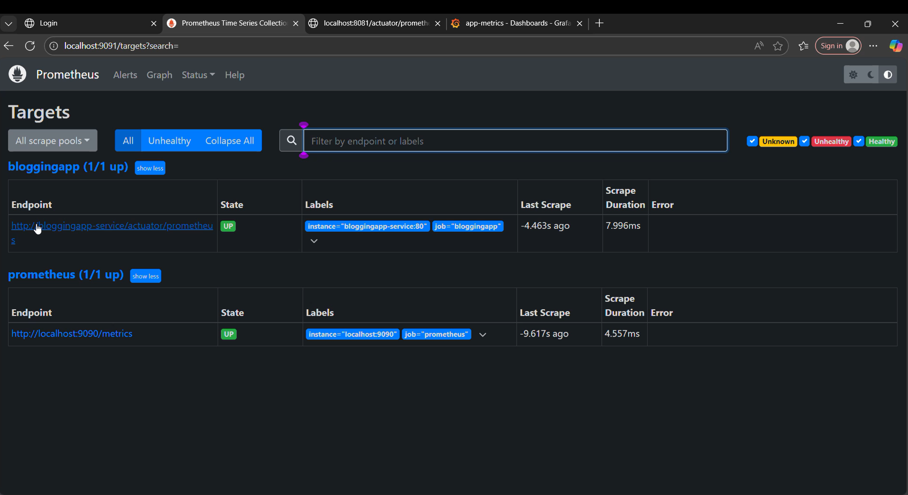
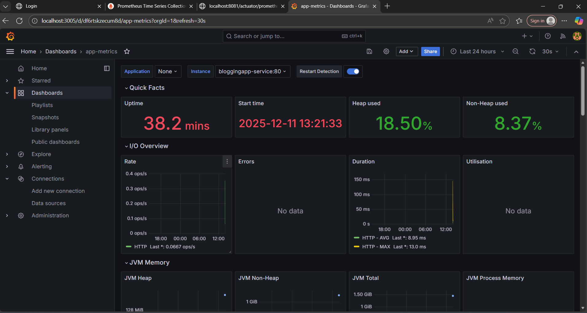
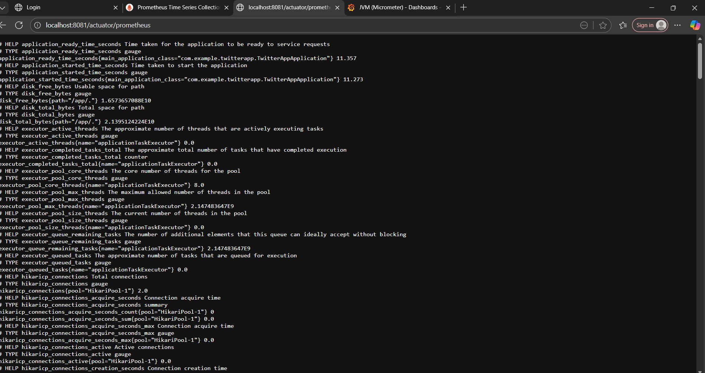
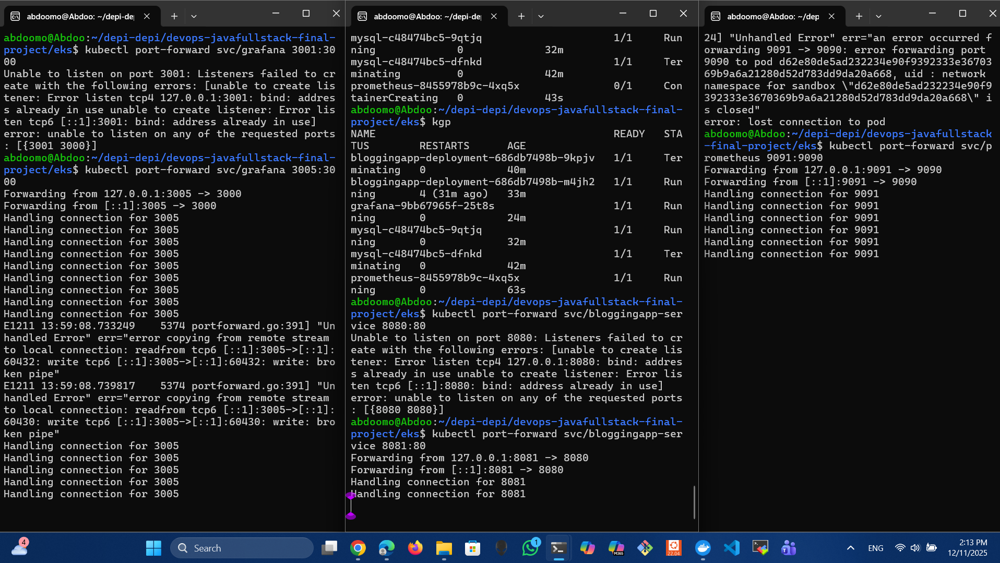

# AWS EKS Deployment — Terraform + ArgoCD + Prometheus + Grafana + MySQL

full production-like setup on EKS, everything provisioned with terraform and deployed via gitops using argocd. monitoring with prometheus & grafana.

---

## what this does

spins up an EKS cluster on AWS from scratch using terraform, deploys a java app with mysql backend, sets up argocd to watch the git repo and auto-deploy on push, and monitors everything with prometheus + grafana.

---

## infra (terraform)

everything is in `main.tf`, single apply and the whole thing comes up.

- VPC `10.0.0.0/16`
- 2 public subnets across 2 AZs — both with `map_public_ip_on_launch = true`
- internet gateway attached to the VPC, route table sends `0.0.0.0/0` through it
- 2 security groups: one for the cluster (egress only), one for the nodes (SSH from your IP only)
- IAM roles: cluster role + node group role with the required EKS managed policies attached
- EKS cluster: `project-cluster` in `us-east-1`
- node group: 4x t3.micro, SSH enabled, autoscaling configured (min=2, max=5)

the state is stored locally (`terraform.tfstate`) — if you're working in a team you'd want to move that to S3 + DynamoDB for locking.

---

## project structure

```
eks/
├── main.tf
├── variables.tf
├── output.tf
├── terraform.tfstate
├── deployment.yaml
├── svc.yaml
├── db.yaml
├── prometheus-configmap.yaml
├── prometheus-deployment.yaml
├── grafana-deployment.yaml
└── argocd-mainfast.yaml
```

---

## how to run

**1. init and apply terraform**

```bash
terraform init
terraform apply -auto-approve
```

takes around 10-15 min for the EKS cluster to fully come up. don't cancel mid-way.

**2. connect kubectl to the cluster**

```bash
aws eks update-kubeconfig --region us-east-1 --name project-cluster
```

verify it's working:

```bash
kubectl get nodes
```

all 4 nodes should show `Ready` before you proceed.

**3. deploy everything**

```bash
kubectl apply -f db.yaml
kubectl apply -f prometheus-configmap.yaml
kubectl apply -f prometheus-deployment.yaml
kubectl apply -f grafana-deployment.yaml
kubectl apply -f deployment.yaml
kubectl apply -f svc.yaml
```

**4. enable argocd gitops**

```bash
kubectl apply -f argocd-mainfast.yaml
```

get the argocd admin password:

```bash
kubectl -n argocd get secret argocd-initial-admin-secret \
  -o jsonpath="{.data.password}" | base64 --decode
```

---

## gitops flow (argocd)

`argocd-mainfast.yaml` creates an ArgoCD `Application` resource that points to this git repo. once applied, argocd polls the repo every few seconds — any change you push to the manifests gets automatically synced to the cluster without you touching kubectl again.

the flow is:
```
push to git → argocd detects diff → applies changes to EKS → done
```

if a deployment fails, argocd shows it in the dashboard with the exact error. you can also set it to auto-rollback but that's not configured here by default.

---

## monitoring

prometheus scrapes metrics from the cluster using the config in `prometheus-configmap.yaml`. grafana connects to prometheus as a data source and visualizes everything.

both are running as ClusterIP services — they're not exposed externally, so you access them via port-forward:

```bash
# prometheus
kubectl port-forward svc/prometheus 9091:9090

# grafana
kubectl port-forward svc/grafana 3005:3000
```

grafana default login: `admin / admin`

on grafana, add prometheus as a data source (`http://prometheus:9090`) then import a dashboard — dashboard ID `3119` works well for kubernetes cluster monitoring.

---

## kubernetes components

- **db.yaml** — mysql 8, database: `twitterdb`, service on port 3306, internal only
- **deployment.yaml** — java app, exposed via loadbalancer service
- **svc.yaml** — service definition for the app
- **prometheus-configmap.yaml** — scrape config for prometheus
- **prometheus-deployment.yaml** — prometheus v2.52, clusterip
- **grafana-deployment.yaml** — grafana v11, clusterip, port 3000
- **argocd-mainfast.yaml** — argocd application pointing to this repo

---

## security

- SSH access to nodes is restricted to your IP only (`<your-ip>/32`) — update this in `main.tf` before applying
- prometheus and grafana are clusterip — not reachable from outside the cluster
- mysql has no external service, internal only on port 3306

---

## screenshots

| | |
|---|---|
| all resources |  |
| app running |  |
| argocd dashboard |  |
| terraform output |  |
| load balancer |  |
| prometheus |  |
| grafana |  |
| metrics |  |
| port-forward |  |
